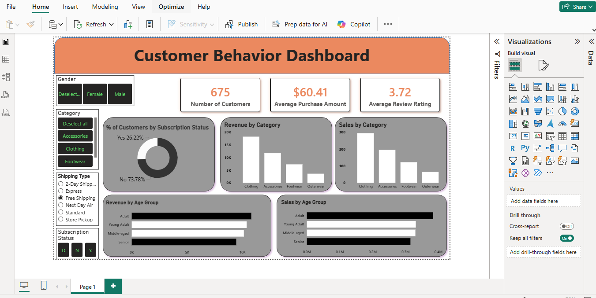

# Retail_Shopping_Details_Data_Analysis_Project
This project focuses on end-to-end data analytics: importing a dataset in Python, cleaning and transforming data, running SQL queries, exploring patterns via EDA, building a Power BI dashboard, and presenting insights in a final summary deck.

The analysis highlights sales trends, customer behavior, profit patterns, and growth opportunities.

## 📦 Dataset

| Attribute              | Details                                         |
| ---------------------- | ----------------------------------------------- |
| **Source**             | Public dataset available in this repository     |
| **Access**             | `/retail_shopping_data.csv/` folder in this GitHub repo             |
| **Records (Rows)**     | **3,900**                                       |
| **Features (Columns)** | **18**                                          |
| **Type**               | Transactional sales & customer purchase dataset |
| **Format**             | CSV                                             |

## 🛠️ Tools & Technologies

| Category        | Tools                                       |
| --------------- | ------------------------------------------- |
| Programming     | Python (Pandas)
| Databases       | PostgreSQL / MySQL / SQL Server             |
| Visualization   | Power BI                                    |
| Version Control | Git & GitHub                                |

## 📊 Dashboard:

## 🔍 Steps & Workflow

#### 1️⃣ Data Loading
- Imported CSV via `pandas.read_csv()`

#### 2️⃣ Data Cleaning
- Removed duplicates & nulls  
- Standardized date format  
- Outlier treatment (IQR)  
- Categorical encoding

#### 3️⃣ SQL Analysis
- KPI extraction (Sales, Profit, AOV)
- Region & Month breakdown
- Customer segmentation
- Top & bottom product trends

#### 4️⃣ EDA Insights
- Seasonal sales peaks
- Profit vs category trends
- Repeat purchase % analysis
- Correlation heatmap

#### 5️⃣ Dashboard
- Sales overview visual
- Regional revenue heatmap
- Category contribution chart
- Customer retention metrics
